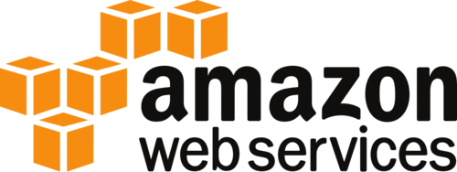

# amazonian [](https://circleci.com/gh/larse514/amazonian)
[Opensource](https://larse514.github.io/amazonian/) tool to faciliate AWS container based application development

## what does amazonian do?
 <br />
The goal of amazonian is to abstract away the complexity of deploying containers in AWS.  You can use your own cluster, or let amazonian create one for you.  Either way, just provide a few configuration values and amazonian will deploy, run, monitor, and secure your containers for you.  It's your infrastructure so there's no cost, other than what is required to run a cluster.

## how can I use it?
Through the power of AWS ECS, Fargate, and Docker; amazonian strives to keep things simple.  In order to get started there is only one short command that you need to run to deploy a working container 

```bash
$ ./amazonian --HostedZoneName=<Route 53 Hosted Zone> --Image=<Image Name> --PortMapping=<Container Port>
```
## what is amazonian doing for me?

Amazonian leverages cutting edge aws serivces to provide: <br />

* **Realtime Monitoring and Application Metrics**
* **Distributed Log Aggregation**
* **TLS Certificate Management**
* **Securely Provisioned Networks**

These enable you to focus on growing your business, not maintaining servers

<br />

 <br />


## running amazonian

Once the amazonian binary is installed, it can be executed from the command line.  There is currently no UI associated with amazonian as the main target is to facilitate CI/CD pipelines

## setup

The following steps are required to configure your environment to be able to run amazonian

**Step 1: _AWS IAM User_** <br />
Amazonian leverages the AWS SDKs in order to build the necessary infrastructure to support your containers.  This requires the environment with which amazonian is executed to be setup with appropriate IAM credentials and AWS configuration.  AWS provides documentation here:
[AWS docs](https://docs.aws.amazon.com/sdk-for-go/v1/developer-guide/configuring-sdk.html) <br /> 

Amazonian itself requires the following minimum permissions to execute:
TO BE ADDED

**Step 2: _Route 53 Hosted Zone_** <br />
In order to reduce cost and increase flexibility, ecs uses DNS routing to route HTTP calls to the correct container service.  Rather than create a unique load balancer, each service will create a [RecordSetGroup](https://docs.aws.amazon.com/AWSCloudFormation/latest/UserGuide/aws-properties-route53-recordsetgroup.html) and an [ALB Routing Rule](https://docs.aws.amazon.com/elasticloadbalancing/latest/application/load-balancer-listeners.html) to direct the HTTP request to the desired service.

**Step 3: _Docker Repository_** <br />
The last thing you need is a Docker image hosted in a repository.  AWS's [ECR](https://aws.amazon.com/ecr/) or [DockerHub](https://hub.docker.com/) are both great options.
### parameters
The following describes the parameters you can use to customize amazonian deployments.

| Paramater      | Description                                                            | Required | Default   | Note                                                    |
|----------------|------------------------------------------------------------------------|----------|-----------|---------------------------------------------------------|
| VPC            | Target VPC to deploy your containers                                   | Yes      | None      |                                                         |
| Priority       | Priority to use for Load Balancer Listener rules                       | Yes      | None      | This will be removed soon for a dynamic lookup          |
| HostedZoneName | Route 53 hosted zone name to use for cluster and container deployments | Yes      | None      |                                                         |
| Image          | Docker Repository Image to be deployed as a container                  | Yes      | None      |                                                         |
| ServiceName    | Name of container service to be deployed                               | Yes      | None      |                                                         |
| ContainerName  | Name of container to be deployed                                       | Yes      | None      |                                                         |
| ClusterName    | Name of ECS Cluster to use                                             | Yes      | None      | This will be expanded to include Fargate and Kubernetes |
| ClusterExists  | Specify whether to use an existing cluster                             | No       | false     |                                                         |
| Subnets        | List of VPC Subnets to deploy cluster to.                              | Sometimes       |           | Required if ClusterExists is false                      |
| KeyName        | Key name to use for EC2 instances within ECS cluster.                  | No       |           |                                                         |
| ClusterSize    | Number of host machines for cluster.                                   | No       | 1         |                                                         |
| MaxSize        | Max number of host machines cluster can scale to                       | No       | 1         |                                                         |
| InstanceType   | Type of EC2 machine                                                    | No       | t2.medium | Required if ClusterExists is false                      |

An example command of how you might run amazonian can be seen below:

`./amazonian --VPC=vpc-c7aa77be --Priority=12 --HostedZoneName=vssdevelopment.com --Image=larse514/gohelloworldservicecontainer:latest --ServiceName=Node --ContainerName=Hello --ClusterName=amazonian-ecs-dev --ClusterExists=false --Subnets=subnet-b61d81fe,subnet-0202dc58 --KeyName=dummy_key1 ClusterSize=1 mazSizePrt=1 instanceTypePrt=t2.medium`


## installation
Eventually the plan is to add this as a commandline tool and distribute it to various targets.  MacOS (Homebrew) Ubuntu (Debian) are the first two targeted OS platform.
<br />
<br />
In the meantime there are two options to use amazonian:  <br />
1) Pull the binary from the temporary S3 distribution bucket here: [amazonian](https://s3.amazonaws.com/amazonian.package.release/latest/amazonian) <br />
2) A full install and build <br />

## contributing
If you would like to contribute to amazonian feel free to create a pull request or to fork the project itself. While amazonian is still under active development, and has not been released in any form, also feel free to raise issues as that will aide the development process.

## development environment setup
amazonian requires Golang and the aws go SDK installed

Step 1: _Install Go_ <br />
Follow the installation process in [Golang](https://golang.org/doc/install#install) docs <br /> 
Step 2: _Install Go SDK_ <br />
Follow the setup process defined in the [AWS docs](https://docs.aws.amazon.com/sdk-for-go/v1/developer-guide/configuring-sdk.html) <br />
Step 3: _IAM Role Setup_ <br />
TODO- add required role permissions<br />

## build 
Step 1: _clone from git_ <br />
`$ git clone https://github.com/larse514/amazonian.git`  <br />
Step 2: _build amazonian_ <br />
`$ make` <br />
Step 3: test amazonian_ <br />
`$ make test` <br />
or if you don't want to see the verbose logs 
`$ make test-min` <br />
