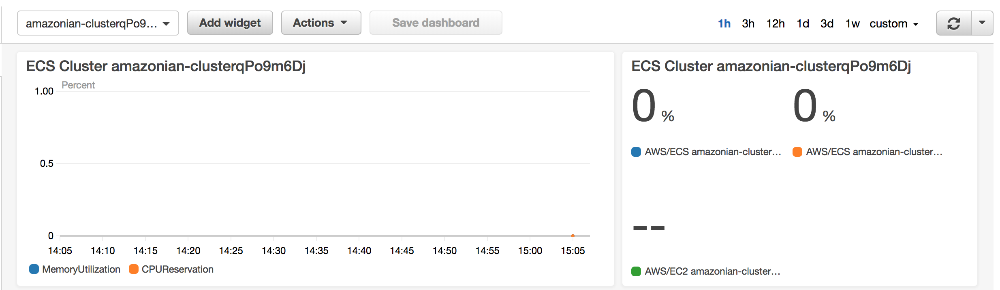
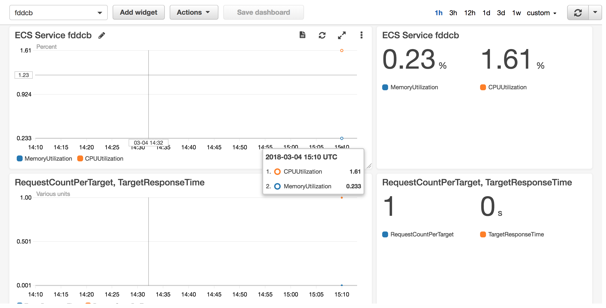
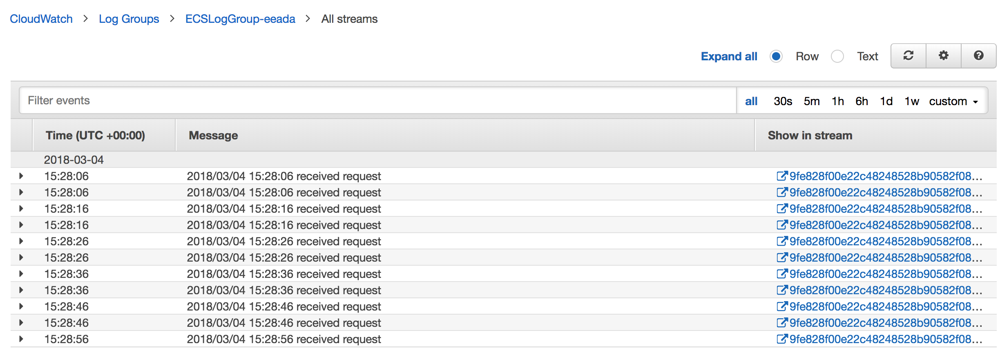
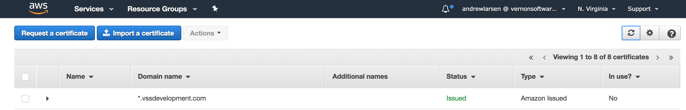

# amazonian [](https://circleci.com/gh/larse514/amazonian) [](https://goreportcard.com/report/github.com/larse514/amazonian)
[Opensource](https://larse514.github.io/amazonian/) tool to faciliate AWS container based application development

## what does amazonian do?
 <br />
The goal of amazonian is to abstract away the complexity of deploying containers in AWS.  You can use your own cluster, or let amazonian create one for you.  Either way, just provide a few configuration values and amazonian will deploy, run, monitor, and secure your containers for you.  It's your infrastructure so there's no cost, other than what is required to run a cluster.

## how can I use it?
Through the power of AWS ECS, Fargate (coming soon), and Docker; amazonian strives to keep things simple.  In order to get started there is only one short command that you need to run to deploy a vpc, cluster, and working container

```bash
$ ./amazonian --HostedZoneName=<Route 53 Hosted Zone> --Image=<Image Name> --PortMapping=<Container Port>
```
## what is amazonian doing for me?

Amazonian leverages cutting edge aws serivces to provide: <br />

* **Realtime Monitoring and Application Metrics**
* **Distributed Log Aggregation**
* **TLS Certificate Management**
* **Securely Provisioned Networks**

These enable you to focus on growing your business, not maintaining servers.  Here's how:

### Realtime Monitoring and Application Metrics- AWS Cloudwatch
AWS Cloudwatch offers realtime monitoring and metrics through the use of alarms, metrics, and dashboards.  These are setup through direct integrations with AWS services leveraged by amazonian. <br/>

In addition to creating your ECS cluster amazonian will also create a Cloudwatch dashboard to monitor your cluster's Autoscaling and EC2 instances CPU and Memory consumption
 <br />

Addionally amazonian will create Cloudwatch dashboards to monitor your ECS Services Memory and CPU utilization; as well as total request count and response time.  *(Note- request count is the sum total per minute while response time is based on 95th percentile)*  
 <br />

### Distributed Logging- AWS Cloudwatch Logs
Tradional logging becomes challenging when dealing with the ephemeral nature of containers.  Amazonian uses ECS's [awslogs](https://docs.aws.amazon.com/AmazonECS/latest/developerguide/using_awslogs.html) logging driver to output all logs as AWS Cloudwatch logs. These can then be viewed in the AWS console.  All you need to do is ensure your application is logging to stdout and stderr
 <br />

### TLS Certificate Management- Amazon Certificate Manager (ACM)
Amazonian uses [AWS ACM](https://docs.aws.amazon.com/acm/latest/userguide/acm-overview.html) to create a wild card cert that is used to secure service endpoints.  Currently each cluster uses its own ACM certificate.  For example, a dev environment may use *.dev.amazonian.com, stage may use *.stage.amazonian.com while prod may use *.amazonian.com

<br />

### Secure by Default Network Topology
Amazonian uses [AWS VPC Best Practices](https://docs.aws.amazon.com/quickstart/latest/vpc/architecture.html) to create a secure by default netowork topology.  This means that only the public load balancer is accessible from the internet.  The cluster itself is secured within a private subnet.  

## running amazonian

Once the amazonian binary is installed, it can be executed from the command line.  There is currently no UI associated with amazonian as the main target is to facilitate CI/CD pipelines

## setup

The following steps are required to configure your environment to be able to run amazonian

**Step 1: _AWS IAM User_** <br />
Amazonian leverages the AWS SDKs in order to build the necessary infrastructure to support your containers.  This requires the environment with which amazonian is executed to be setup with appropriate IAM credentials and AWS configuration.  AWS provides documentation here:
[AWS docs](https://docs.aws.amazon.com/sdk-for-go/v1/developer-guide/configuring-sdk.html) <br /> 

Amazonian itself requires the following minimum permissions to execute (note this can be refined further for [least priviledge](https://docs.aws.amazon.com/IAM/latest/UserGuide/best-practices.html#grant-least-privilege):

```json
{
    "Version": "2012-10-17",
    "Statement": [
        {
            "Sid": "Stmt1520651333659",
            "Action": [
                "cloudformation:CreateStack",
                "cloudformation:DescribeStacks",
                "cloudformation:UpdateStack"
            ],
            "Effect": "Allow",
            "Resource": "*"
        },
        {
            "Sid": "Stmt1520651471837",
            "Action": [
                "elasticloadbalancing:DeleteRule"
            ],
            "Effect": "Allow",
            "Resource": "*"
        },
        {
            "Sid": "Stmt1520652233156",
            "Action": "ec2:*",
            "Effect": "Allow",
            "Resource": "*"
        },
        {
            "Sid": "Stmt1520652719751",
            "Action": "ecs:*",
            "Effect": "Allow",
            "Resource": "*"
        },
        {
            "Sid": "Stmt1520652937134",
            "Action": "acm:*",
            "Effect": "Allow",
            "Resource": "*"
        },
        {
            "Sid": "Stmt1520653163038",
            "Action": "elasticloadbalancing:*",
            "Effect": "Allow",
            "Resource": "*"
        },
        {
            "Sid": "Stmt1520653378777",
            "Action": [
                "iam:CreateRole"
            ],
            "Effect": "Allow",
            "Resource": "*"
        },
        {
            "Sid": "Stmt1520653785271",
            "Action": [
                "iam:CreateRole",
                "iam:PutRolePolicy"
            ],
            "Effect": "Allow",
            "Resource": "*"
        },
        {
            "Sid": "Stmt1520654006105",
            "Action": "cloudwatch:*",
            "Effect": "Allow",
            "Resource": "*"
        },
        {
            "Sid": "Stmt1520654617594",
            "Action": [
                "iam:CreateInstanceProfile",
                "iam:CreateRole",
                "iam:PutRolePolicy"
            ],
            "Effect": "Allow",
            "Resource": "*"
        },
        {
            "Sid": "Stmt1520655055968",
            "Action": "iam:*",
            "Effect": "Allow",
            "Resource": "*"
        },
        {
            "Sid": "Stmt1520656446477",
            "Action": "autoscaling:*",
            "Effect": "Allow",
            "Resource": "*"
        },
        {
            "Sid": "Stmt1520656985244",
            "Action": [
                "route53:ListHostedZones"
            ],
            "Effect": "Allow",
            "Resource": "*"
        },
        {
            "Sid": "Stmt1520657614009",
            "Action": "logs:*",
            "Effect": "Allow",
            "Resource": "*"
        },
        {
            "Sid": "Stmt1520658456941",
            "Action": [
                "route53:ChangeResourceRecordSets"
            ],
            "Effect": "Allow",
            "Resource": "*"
        },
        {
            "Sid": "Stmt1520658924046",
            "Action": [
                "route53:GetChange"
            ],
            "Effect": "Allow",
            "Resource": "*"
        },
        {
            "Sid": "Stmt1520659570830",
            "Action": [
                "application-autoscaling:DescribeScalableTargets",
                "application-autoscaling:RegisterScalableTarget"
            ],
            "Effect": "Allow",
            "Resource": "*"
        },
        {
            "Sid": "Stmt1520660307988",
            "Action": [
                "application-autoscaling:DescribeScalingPolicies"
            ],
            "Effect": "Allow",
            "Resource": "*"
        },
        {
            "Sid": "Stmt1520660354923",
            "Action": [
                "application-autoscaling:PutScalingPolicy"
            ],
            "Effect": "Allow",
            "Resource": "*"
        }
    ]
}
```
**Step 2: _Route 53 Hosted Zone_** <br />
In order to reduce cost and increase flexibility, ecs uses DNS routing to route HTTP calls to the correct container service.  Rather than create a unique load balancer, each service will create a [RecordSetGroup](https://docs.aws.amazon.com/AWSCloudFormation/latest/UserGuide/aws-properties-route53-recordsetgroup.html) and an [ALB Routing Rule](https://docs.aws.amazon.com/elasticloadbalancing/latest/application/load-balancer-listeners.html) to direct the HTTP request to the desired service.  An AWS Route 53 [HostedZone](https://docs.aws.amazon.com/Route53/latest/DeveloperGuide/CreatingHostedZone.html) is required to create the necessary RecordSetGroup

**Step 3: _Docker Repository_** <br />
The last thing you need is a Docker image hosted in a repository.  AWS's [ECR](https://aws.amazon.com/ecr/) or [DockerHub](https://hub.docker.com/) are both great options.
### parameters
The following describes the parameters you can use to customize amazonian deployments.

| Paramater          | Description                                                            | Required | Default     | Note                                                           |
|--------------------|------------------------------------------------------------------------|----------|-------------|----------------------------------------------------------------|
| VPCId              | Target VPC to deploy your containers                                   | Yes      | None        |                                                                |
| VPCName            | Name of VPC to have amazonian use or create                            | No       | Random Name |                                                                |
| PortMapping        | Exposed container port                                                 | Yes      | None        |                                                                |
| HostedZoneName     | Route 53 hosted zone name to use for cluster and container deployments | Yes      | None        |                                                                |
| Image              | Docker Repository Image to be deployed as a container                  | Yes      | None        |                                                                |
| ServiceName        | Name of container service to be deployed                               | No       | Random Name |                                                                |
| ContainerName      | Name of container to be deployed                                       | No       | Random Name |                                                                |
| ClusterName        | Name of ECS Cluster to use                                             | No       | Random Name | This will be expanded to include Fargate and Kubernetes        |
| ClusterSubnets     | List of VPC Subnets to deploy cluster to                               | No       | None        | Required if cluster and vpc exists                             |
| ELBSubnets         | List of VPC Subnets to deploy Load Balancers to                        | No       | None        | Required if cluster and vpc exists                             |
| KeyName            | Key name to use for EC2 instances within ECS cluster.                  | No       | None        |                                                                |
| ClusterSize        | Number of host machines for cluster.                                   | No       | 1           |                                                                |
| MaxSize            | Max number of host machines cluster can scale to                       | No       | 1           |                                                                |
| InstanceType       | Type of EC2 machine                                                    | No       | t2.medium   | Required if cluster and vpc exists                             |
| ECSClusterARN      | AWS ECS Cluster Amazon Resource Name                                   | No       | None        | If provided, all other ECS Parameters must be provided as well |
| ECSALBHostedZoneID | AWS Application Load Balancer Hosted Zone Id                           | No       | None        | If provided, all other ECS Parameters must be provided as well |
| ECSALBDNSName      | AWS ALB DNS Name                                                       | No       | None        | If provided, all other ECS Parameters must be provided as well |
| ECSALBArn          | AWS ALB Amazon Resource Name                                           | No       | None        | If provided, all other ECS Parameters must be provided as well |
| ECSALBListener     | AWS ALB Listener ARN                                                   | No       | None        | If provided, all other ECS Parameters must be provided as well |
| ECSALBFullName     | AWS ALB Full Name                                                      | No       | None        | If provided, all other ECS Parameters must be provided as well |

### use your own VPC

Amazonian allows you to use your own VPC.  In order to do so you just need to specify your VPC's VPCID, Public Subnet IDs (for the ALB load balancer), and Cluster Subnet IDs (for ECS cluster).  Amazonian will then create the required ECS cluster infrastructure for you! *(Note- Subnet id's must be a comma separate list)*</br>


The following command will spin up an ECS Cluster in your VPC and run the Amazonian hello world container:

`./amazonian --VPCId=<YOUR VPC ID> --ELBSubnets=<Comma Separated SubnetIDs> --ClusterSubnets=<Comma Separated SubnetIDs> --HostedZoneName=<hostedzonename> --Image=larse514/gohelloworldservicecontainer:latest --ServiceName=Hello --ContainerName=Hello --PortMapping=8080`

### use your own ECS Cluster

Amazonian also allows you to use your own ECS Cluster, and by default your own VPC since the cluster must exist in a VPC anyway.  You will also need an [AWS Application Load Balancer](https://docs.aws.amazon.com/elasticloadbalancing/latest/application/introduction.html) and associated [Target Group](https://docs.aws.amazon.com/elasticloadbalancing/latest/application/load-balancer-target-groups.html) as well as an [AWS Route 53 Hosted Zone](https://docs.aws.amazon.com/Route53/latest/DeveloperGuide/CreatingHostedZone.html). In order to deploy your container you just need to specify your VPC's VPCID; and your AWS ECS Cluster's Amazon Resource Name (ARN), Application Load Balancer (ALB) ARN, ALB DNS Name, ALB Hosted Zone Id, ALB Listener ARN, and ALB Full Name.  Amazonian will then create the required Container infrastructure


The following command will spin up an ECS Cluster in your VPC and run the Amazonian hello world container:

`./amazonian --VPCId=<YOUR VPC ID> --HostedZoneName=<hostedzonename> --Image=larse514/gohelloworldservicecontainer:latest --ServiceName=Hello --ContainerName=Hello --PortMapping=8080 --ECSClusterARN=<Your Cluster ARN> --ECSALBHostedZoneID=<Your ALB Hosted Zone ID> --ECSALBDNSName=<Your ALB DNS Name> --ECSALBArn=<Your ALB Arn> --ECSALBListener=<Your ALB Listern ARN> --ECSALBFullName=<Your ALB Full Name>`

## installation
Eventually the plan is to add this as a commandline tool and distribute it to various targets.  MacOS (Homebrew) Ubuntu (Debian) are the first two targeted OS platform.
<br />
<br />
In the meantime there are two options to use amazonian:  <br />
1) Pull the binary from the temporary S3 distribution bucket here: [amazonian](https://s3.amazonaws.com/amazonian.package.release/latest/amazonian) <br />
2) A full install and build <br />

## contributing
If you would like to contribute to amazonian feel free to create a pull request or to fork the project itself. While amazonian is still under active development, and has not been released in any form, also feel free to raise issues as that will aide the development process.

## development environment setup
amazonian requires Golang and the aws go SDK installed

Step 1: _Install Go_ <br />
Follow the installation process in [Golang](https://golang.org/doc/install#install) docs <br /> 
Step 2: _Install Go SDK_ <br />
Follow the setup process defined in the [AWS docs](https://docs.aws.amazon.com/sdk-for-go/v1/developer-guide/configuring-sdk.html) <br />
Step 3: _IAM Role Setup_ <br />
TODO- add required role permissions<br />

## build 
Step 1: _clone from git_ <br />
`$ git clone https://github.com/larse514/amazonian.git`  <br />
Step 2: _build amazonian_ <br />
`$ make` <br />
Step 3: test amazonian_ <br />
`$ make test` <br />
or if you don't want to see the verbose logs 
`$ make test-min` <br />
